# Bugs encontrados – página web Mi Casa

**1.** Cambio de clave

Al realizar el cambio de clave, incluso cuando se ingresa exactamente la misma contraseña en ambos campos (copiando y pegando la misma clave), el sistema muestra el mensaje “La clave no coincide”. Sin embargo, a pesar de esta validación, permite guardar la nueva clave.

Se adjunta imagen como evidencia del comportamiento presentado.

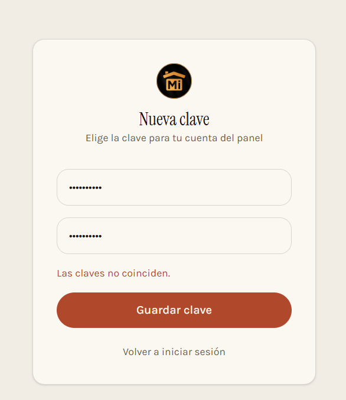

**2.** Al momento de aceptar la invitación, el sistema únicamente solicita realizar el cambio de clave; sin embargo, no se solicita la creación o confirmación del usuario, ni se asigna automáticamente el usuario correspondiente a la invitación.

Como prueba, ingresé por defecto el correo electrónico al cual fue enviada la invitación, pero este no corresponde al usuario que debería asignarse.

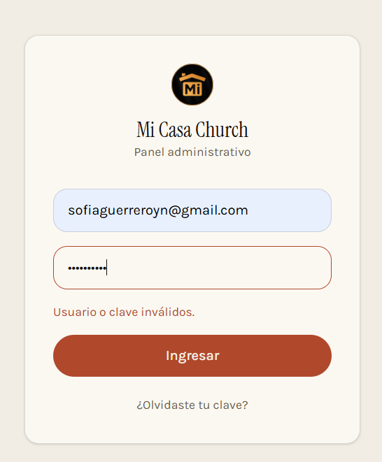

**3.** Actualizar el apartado de “Prédicas”, ya que el mensaje que se muestra actualmente no corresponde con la información esperada.

Adicionalmente, al ingresar con un usuario administrador, no fue posible identificar de manera clara en qué sección o menú se debe ingresar para realizar la actualización de este contenido.

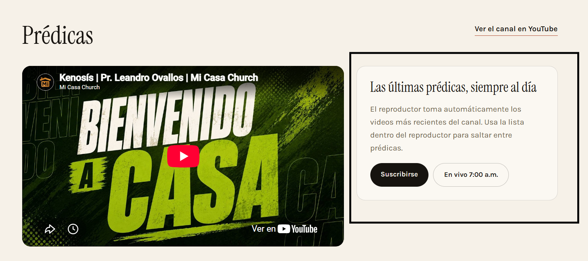

**4.** En el apartado de “Prédicas”, específicamente en la opción “En vivo 7:00 a. m.”, al intentar acceder al contenido, este no se visualiza la imagen correspondiente. La novedad se presenta tanto desde el PC como desde el dispositivo móvil. Adjunto imágenes como evidencia para su revisión. Es importante mencionar que si dirige de manera correcta al canal de mi casa en Facebook.

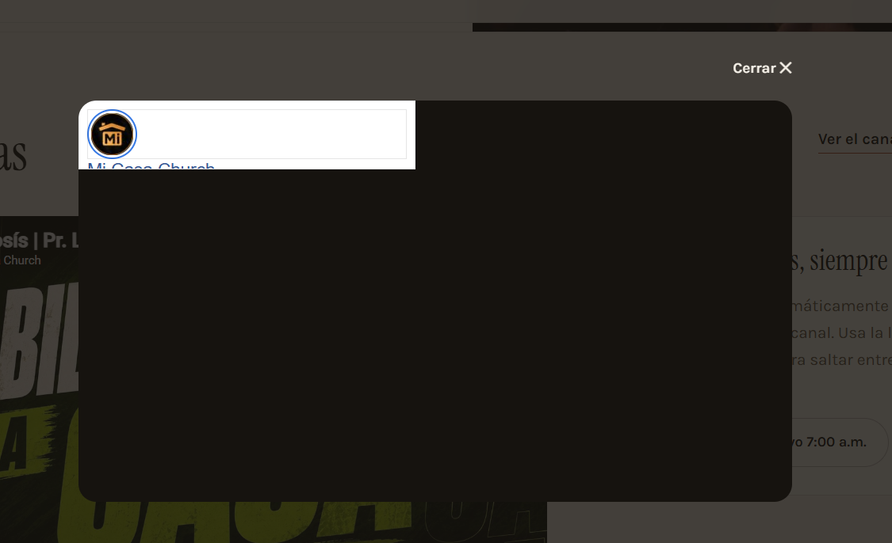

**5.** En este mismo apartado, al seleccionar la opción “Cerrar”, la página no conserva la posición en la que se encontraba el usuario. Al cerrar, la página se desplaza automáticamente hacia otro apartado diferente, generando un cambio inesperado en la ubicación dentro del contenido.

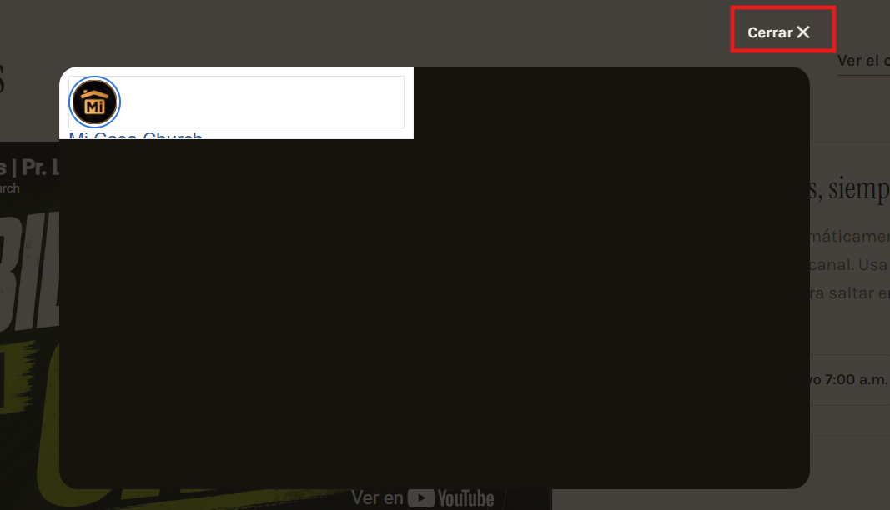

Luego de seleccionar la opción “Cerrar”, se muestra el siguiente apartado:

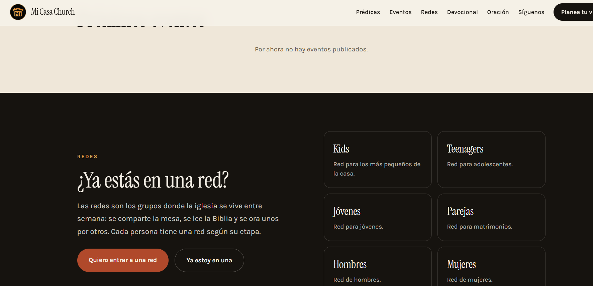

**6.** En el apartado “¿Ya estás en una red?”, al seleccionar la opción “Ya estoy en una”, ¿es esperado que la página se desplace automáticamente hasta el final de la página?

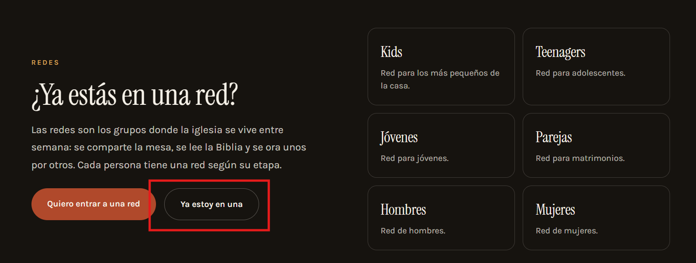

**7.** No es posible escanear los códigos QR. Se requiere validar si la novedad está relacionada con la generación de los códigos QR o si la página no los está mostrando correctamente, ya que al intentar escanearlos no son reconocidos.

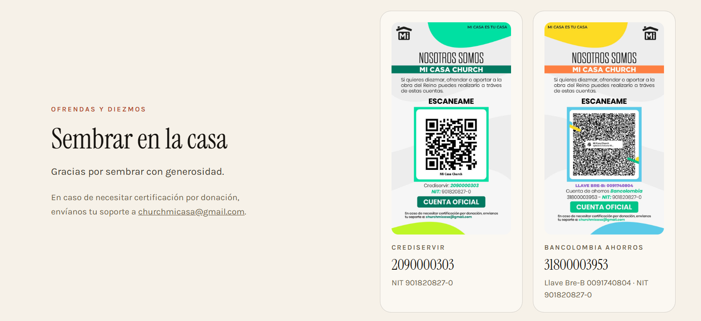

**8.** En el apartado “Quiénes somos”, en la opción “Cómo llegar”, se recomienda que el botón redirija directamente a Google Maps con la ubicación de la iglesia, en lugar de desplazar al usuario al final de la página, donde actualmente se muestra la información de ubicación.

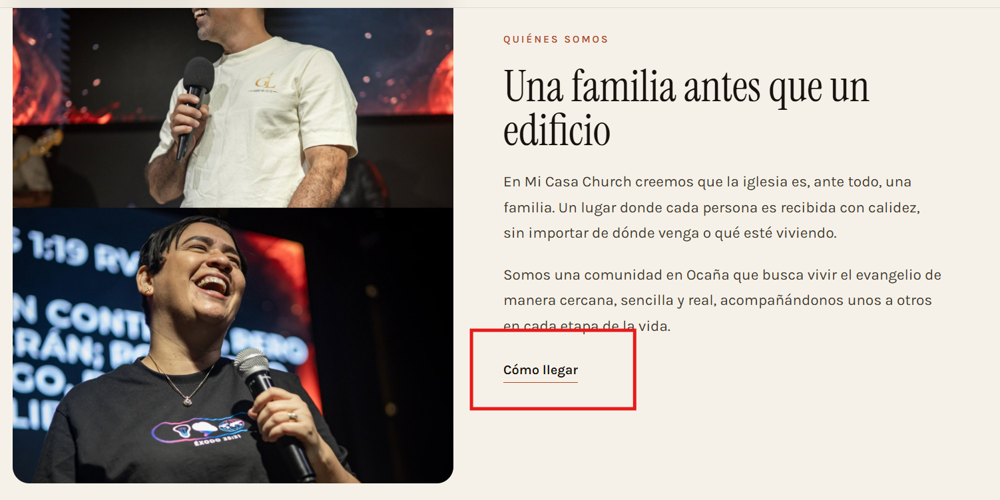

Nota es importante cambiar el titulo de quienes somos, al ingresar a contenido no se encontró donde cambiar el título.

**9.** Se recomienda que este apartado quede al finalizar la pagina 

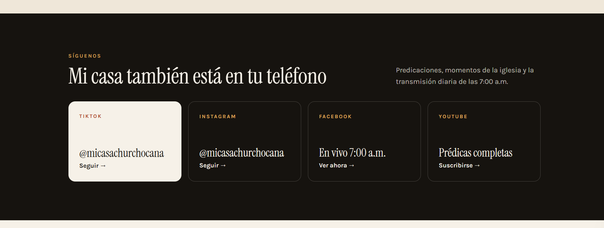

**10.** En el apartado “Síguenos”, se presenta nuevamente la misma novedad al intentar ingresar a Facebook. 

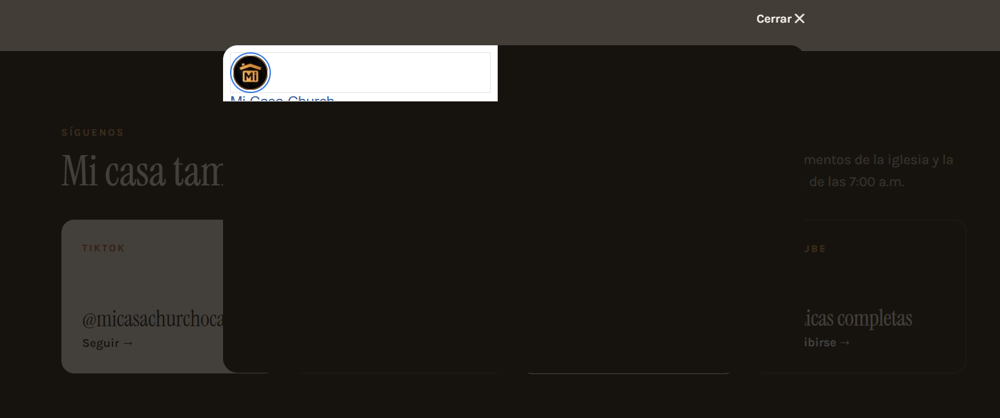

Al darle cerrar nuevamente me envía a un apartado diferente. 

**11.** Para las peticiones de oración, se recomienda agregar una validación en el campo “Sea tu petición”, de manera que sea obligatorio ingresar una petición antes de habilitar o permitir la opción “Enviar petición”. Actualmente, al seleccionar “Enviar petición” sin haber diligenciado el campo, la solicitud no se envía, pero el sistema no muestra ningún mensaje que indique al usuario que debe ingresar su petición.

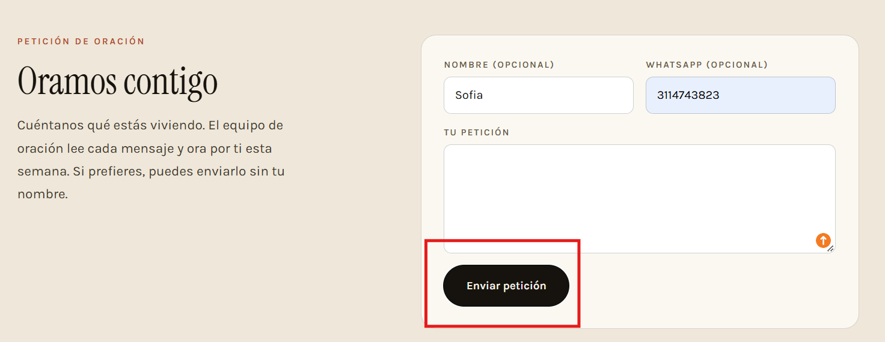

**12.** Se recomienda implementar validaciones en los campos del formulario para enviar una petición de oración, de acuerdo con el tipo de información que debe ingresar el usuario.

    - En el campo “Nombre”, permitir únicamente caracteres alfabéticos y restringir el ingreso de números o caracteres no válidos.

    - En el campo “WhatsApp”, validar que únicamente se puedan ingresar números, de acuerdo con el formato establecido para números telefónicos.

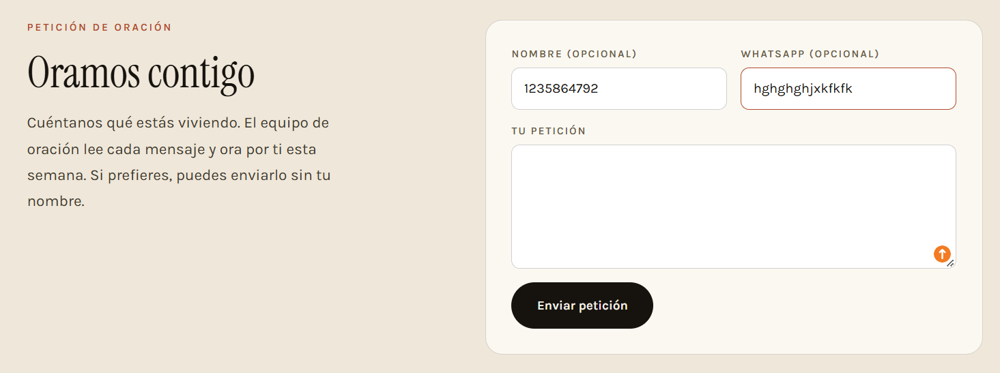

**13.** En el apartado “Devocional diario”, se sugiere agregar un botón de “volver” o una flecha que indique como volver al sitio para mejorar la experiencia de usuario. Actualmente, una vez se ingresa a este apartado, la única forma de regresar a la página principal es mediante la opción “Planea tu visita” o en mi casa church

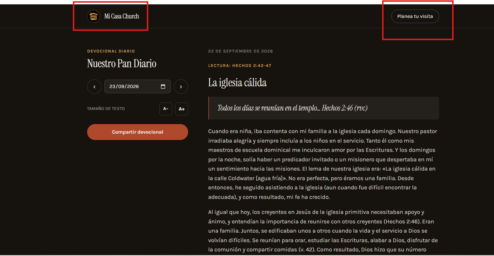

**14.** Responsive del enlace de nuestras redes

Al ingresar a la página desde un dispositivo móvil, en la sección de nuestras redes sociales, los enlaces de TikTok e Instagram se salen de los límites del recuadro, afectando la visualización y el diseño responsive de la sección.

**15.** Visualización incorrecta de la página en dispositivos móviles

Al ingresar a la página desde un dispositivo móvil, se evidencia que el contenido no se adapta correctamente al ancho de la pantalla. La página no ocupa la totalidad del viewport y se presenta un espacio lateral que genera un desajuste en la visualización.

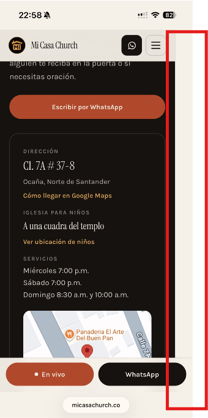

